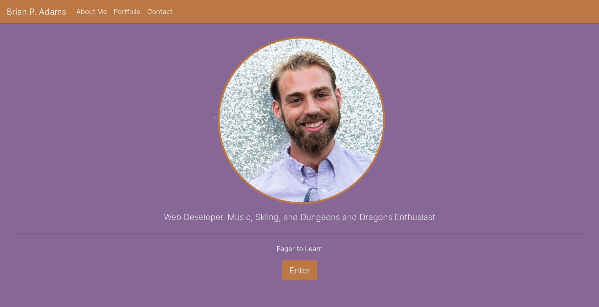
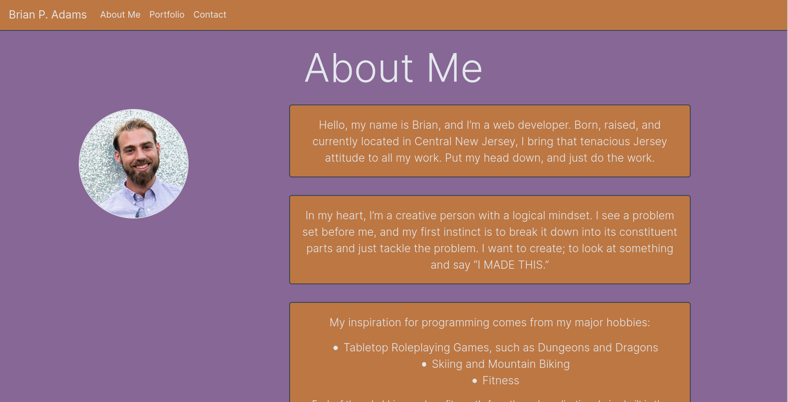
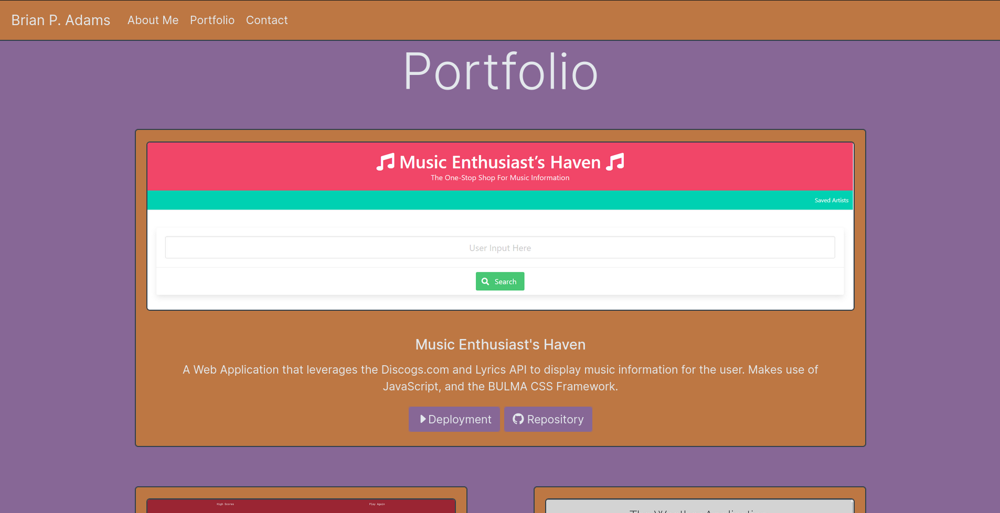
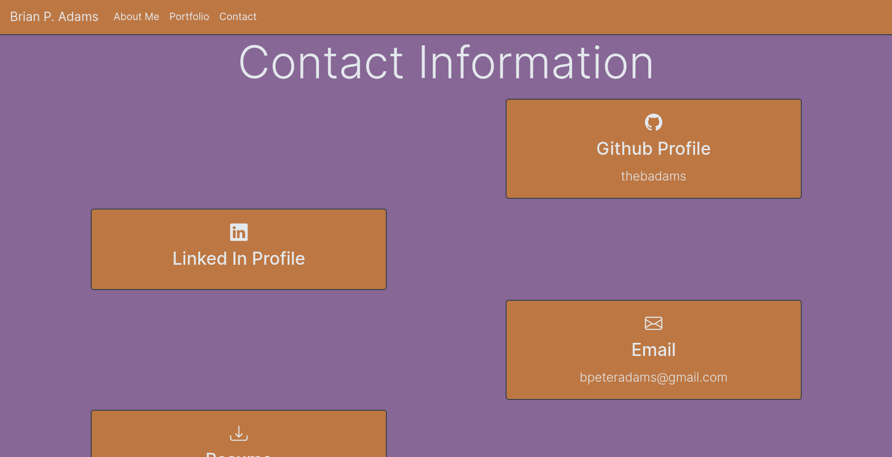
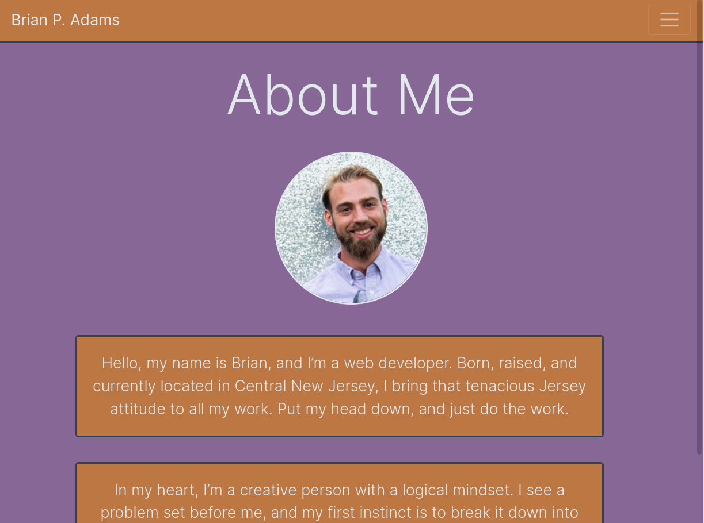
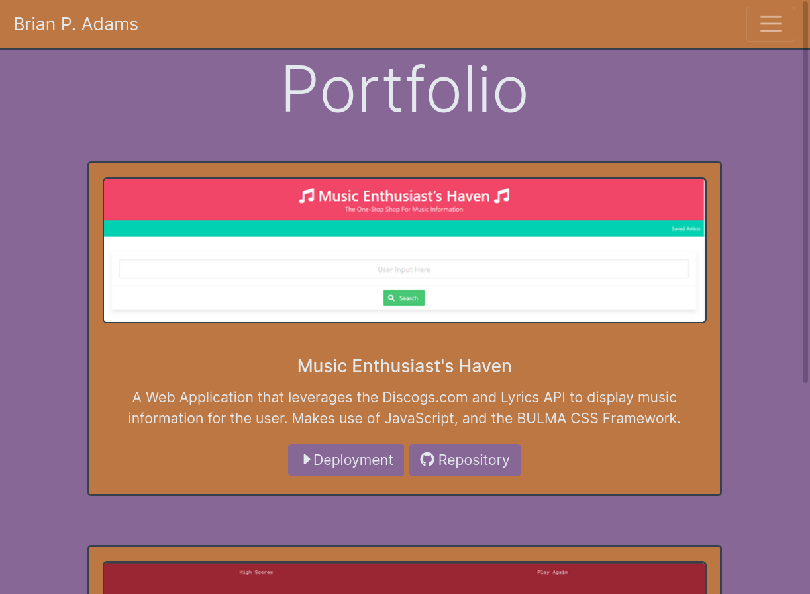
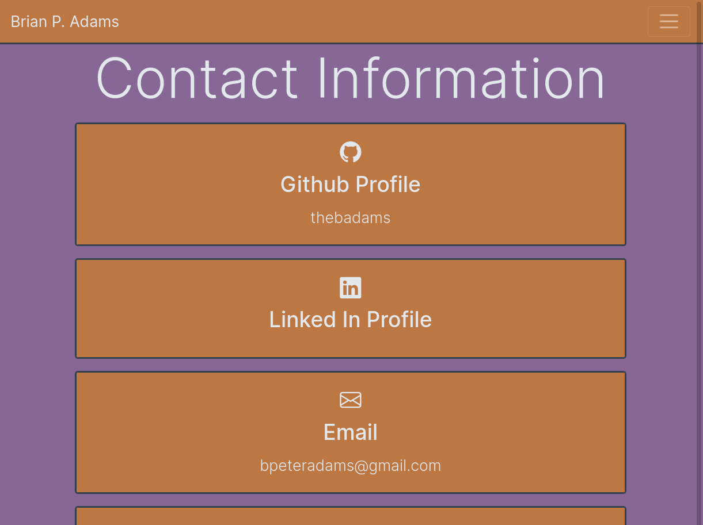

# Professional Portfolio of Brian P. Adams

## Description

This web application is built using HTML and Bootstrap 4 Framework. It is a portfolio of my work, which is changing constantly as I expand my skillset

## Instructions

The behavior of the web application should be as follows:

   1. When the webpage loads, the user is greeted with a landing page which contains the following
    
    A large profile picture
    A short tidbit about me
    A button that will take you to my "about me" page
    A nav bar at the top of the screen

   2. When one follows the links, they should be taken to the requisite page
   3. When one follows the link to the about me section
    
    They will be greeted with a navbar at the top that stays stuck to the top as they scroll
    There will be a smaller profile picture on the left side that stays in place as you scroll
    There will be several blurbs about me
   
   4. When one follows the link to the portfolio section
        
    They wil be greeted with a navbar at the top that stays stuck at the top as they scroll
    There will be several cards detailing three projects:
        1. The Music Project
        2. The Weather Application
        3. The JavaScript Code Quiz
    There are buttons that will take you to that application's deployment, and another that will take you to the github repo. Both open in new pages.

   5. When one follows the link to the contact section
    
    They will be greeted with a navbar on top that stays stuck at the top as they scroll.
    There will be cards that will act as links:
        1. A link to my github portfolio
        2. A link to my linkedin portfolio
        3. A link that will allow the user to send an email to my email
        4. A link that will allow the user to view and download my resume
        5. A link that will allow the user to make a call to my phone
    All links open in a new tab.

   6. Responsive Behaviors

    The application is responsive in the following ways:
        1. The navbar will collapse once it gets below a large screen size.
        2. The cards will collapse into a single column below a large screen size.

## Screenshots

*Screenshots at Full-Width*

*Screenshot at < 992px Screen Width*

## Deployment

The Web Application Can Be Accessed at [This Link](https://thebadams.github.io/thebadams-portfolio/)

The Repository Can Be Found at [This Link](https://github.com/thebadams/thebadams-portfolio)

## Contact Information

I can be contacted at the following places

* [Email](mailto:bpeteradams@gmail.com)
* [Github](https://www.github.com/thebadams)
* [LinkedIn](https://www.linkedin.com/in/brian-adams-5a410b53/)

##  The MIT License (MIT)

Copyright © 2021 <Brian Adams>

Permission is hereby granted, free of charge, to any person obtaining a copy of this software and associated documentation files (the “Software”), to deal in the Software without restriction, including without limitation the rights to use, copy, modify, merge, publish, distribute, sublicense, and/or sell copies of the Software, and to permit persons to whom the Software is furnished to do so, subject to the following conditions:

The above copyright notice and this permission notice shall be included in all copies or substantial portions of the Software.

THE SOFTWARE IS PROVIDED “AS IS”, WITHOUT WARRANTY OF ANY KIND, EXPRESS OR IMPLIED, INCLUDING BUT NOT LIMITED TO THE WARRANTIES OF MERCHANTABILITY, FITNESS FOR A PARTICULAR PURPOSE AND NONINFRINGEMENT. IN NO EVENT SHALL THE AUTHORS OR COPYRIGHT HOLDERS BE LIABLE FOR ANY CLAIM, DAMAGES OR OTHER LIABILITY, WHETHER IN AN ACTION OF CONTRACT, TORT OR OTHERWISE, ARISING FROM, OUT OF OR IN CONNECTION WITH THE SOFTWARE OR THE USE OR OTHER DEALINGS IN THE SOFTWARE.
